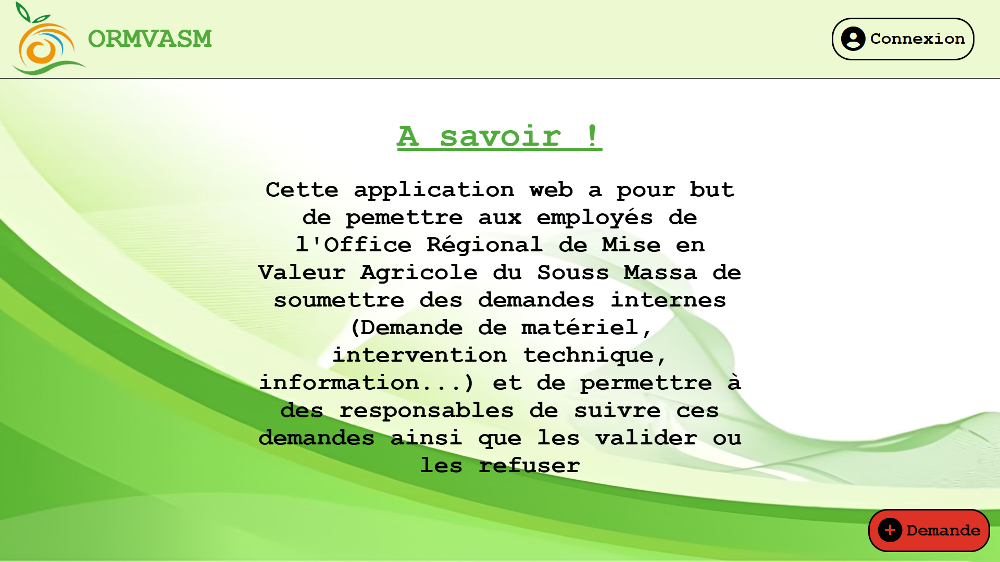

<h1 align="center">🌱 ORMVA-Projet 🌱</h1>



## Introduction

**ORMVA-Projet** est un projet développé en HTML, CSS, PHP, JavaScript, AJAX et SQL lors de mon stage à l'Office Régional de Mise en Valeur Agricole du Souss Massa (ORMVASM). Le projet consiste en la création d’une application web dynamique qui permet aux employés de l'institut d'effectuer des demandes internes (Demande d'information, intervention technique, demande de matériel) et qui permet aux responsables de les suivre et de les traiter.

## Prérequis

- Un navigateur moderne (Chrome, Firefox, Edge, etc.) avec JavaScript activé.
- Une version récente de PHP.
- Un serveur web local (WAMP, MAMP, XAMPP pour Windows, ou MAMP pour macOS, ou LAMP pour Linux) avec support PHP et MySQL.
- phpMyAdmin (inclus dans WAMP/MAMP/XAMPP) pour gérer la base de données.
- MySQL (généralement inclus avec WAMP/MAMP/LAMP).


## Installation

### 1. Installer un serveur local avec MySQL et phpMyAdmin :

- **Sous Windows** : Téléchargez et installez **WAMP** (qui inclut PHP et Apache) à partir de [wampserver.com](https://www.wampserver.com/).
- **Sur macOS** : Téléchargez et installez **MAMP** à partir de [mamp.info](https://www.mamp.info/).
- **Sur Linux** : Installez Apache, PHP et MySQL avec les commandes suivantes :
```sh
  sudo apt update
  sudo apt install apache2 mysql-server php libapache2-mod-php php-mysql
```

### 2. Configurer la base de données : 
- Lancer phpMyAdmin (généralement via http://localhost/phpmyadmin).
- Créer une base de données et la nommer "ormvasmdb".
- Importer le fichier SQL `database/ormvasmdb.sql` dans phpMyAdmin.

### 3. Cloner le projet :
```sh
git clone https://github.com/RayyyZen/ORMVA-Project.git
cd ORMVA-Project
```

### 4. Lancer un serveur local :
- Via WAMP/MAMP : Placez le projet dans le dossier www (ou htdocs) et démarrez le serveur.
- Ou en ligne de commande : 
```sh
php -S localhost:8000
```

### 5. Accéder à l'application :
- Accédez à votre navigateur et entrez l'URL suivante : 
```sh
http://localhost/Pages/index.php
```
Ou Bien
```sh
http://localhost:8000/Pages/index.php
```

## Fonctionnalités principales

L'application web comporte deux interfaces différentes : une interface agent pour les utilisateurs et une interface responsable pour les admins, ainsi que les fonctionnalités suivantes :

### Connexion et inscription

Afin de pouvoir accéder à l'une des interfaces, il faut dabord s'inscrire ou se connecter si vous avez déjà un compte. L'inscription vous met automatiquement le rôle d'utilisateur, vous permettant d'effectuer des demandes et de les visualiser.

### Compte

Après la connexion à votre compte, il vous est possible d'accéder à la page contenant vos informations saisies lors de l'inscription. Sur cette page vous pouvez effectuer des modifications de façon asynchrone, ainsi que voir l'historique de vos demandes et supprimer votre compte en cas de besoin. 

### Demande

Les utilisateurs connectés peuvent effectuer des demandes internes via la page "Demande". Un formulaire à remplir s'y trouve contenant comme champ : le type, le titre ainsi que la description de la demande. 

### Mes demandes

Sur la page "Mes demandes", l'utilisateur peut consulter l'historique de ses demandes ainsi que voir le statut de chacune. Il est possible sur cette page de trier les demandes en fonction du type de cette dernière et de son statut. Dans le cas où l'utilisateur connecté est un administrateur, il peut visualiser toutes les demandes déjà effectuées par les utilisateurs.

### Voir demande

En cliquant sur une demande de la page "Mes demandes" il est possible de voir les détails de celle ci. Si l'utilisateur est un administrateur et que la demande est "En attente" ce dernier peut la valider ou la refuser et ajouter un commentaire.

### Admin

La page administrateur permet aux responsables de voir tous les utilisateurs ainsi que de modifier leurs informations et leur statut de façon asynchrone, sans recharger la page.

## Informations importantes

- ⚠️ Si vous modifiez la structure de la base ou ajoutez des données importantes, pensez à exporter la base et à mettre à jour le fichier `database/ormvasmdb.sql`.


- En important la base de données qui se trouve dans le dossier `/database` sur phpMyAdmin, vous pouvez vous connecter à ces comptes de diffèrents rôles pour tester toutes les fonctionnalités du site : 

### Admin

- Adresse mail : adminray@gmail.com
- Mot de passe : ray

### Utilisateur

- Adresse mail : aa@gmail.com
- Mot de passe : aa

### Banni

- Adresse mail : gg@gmail.com
- Mot de passe : gg

## License

Ce projet est sous licence BSD 2-Clause. Consultez le fichier [LICENSE](LICENSE) pour plus de détails.